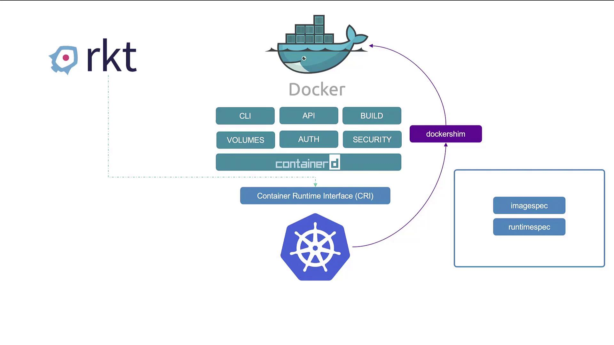

# **Lecture12** - Docker vs ContainerD

## Docker 와 Kubernetes 의 관계

1. 초기 Docker 의 지배
    - 컨테이너 기술 초기 Docker 가 사용자 경험을 단순화하여 가장 지배적인 컨테이너 도구로 사용.
    - `rkt` (Rocket Container) 같은 다른 도구도 있었지만 Docker 대중화.
    - 쿠버네티스는 초기에 Docker 의 오케스트레이터 역할을 하도록 설계되었으며, 그 당시 Docker 와만 긴밀하게 연동.
2. 컨테이너 런타임 인터페이스(Container Runtime Interface, CRI) 도입.
    - Kubernetes 가 인기를 얻으면서, 사용자들은 Docker 외에 다른 컨테이너를 사용하고 싶어함.
    - Kubernetes 는 해당 요구를 충족하기 위해 **컨테이너 런타임 인터페이스 (CRI)** 도입.
    - CRI 는 어떤 벤더는 OCI(Open Container Initiative) 표준 (ImageSpec 및 RuntimeSpec 으로 구성) 을 준수하는 한 쿠버네티스의 컨테이너 런타임으로 작동할 수 있도록 하는 단일 인터페이스.
    - https://github.com/opencontainers
3. Docker Shim 의 등장
    - Docker 는 CRI가 나외 훨씬 전에 만들어 졌으며, CRI 표준을 지원하도록 설계되지 않았다.
    - 그러나, Docker 는 주요 컨테이너 도구 였으므로 계속 지원해야 했다.
    - 이를 위해 `dockeshim` 이라는 임시 방편의 도구를 만들어서 Docker Runtime 을 따로 지원해줬다.
    - 하지만, 유지보수 문제로 Kubernetes 1.2.4 버전부터 `dockershim` 이 완전이 제거 되면서 직접적인 지원을 해제하였다.
    - 현재는 Docker 가 OCI 표준 ImageSpec 을 따르기 때문에, Docker 로 생성된 모든 이미지는 `containerd` 와 같은 OCI 런타임에서 동작한다.

## Containerd 란?

- `containerd` 는 Docker 의 일부였지만, 현재는 독립적인 CNCF 의 프로젝트.
- `containerd` 는 CRI 호환이 가능하며, 쿠버네티스와 직접저으로 작업할 수 있다.
- Docker 의 다른 기능 (CLI, API, Build 등) 이 필요하지 않다면 `containerd` 만 설치하는 것이 이상적.

## CLI 도구

`containerd` 및 CRI 호환 런타임 상호 작용하기 위한 여러 CLI 도구가 존재.

### `ctr`

- `containerd` 를 설치할 때 함께 제공됨.
- 오직 디버깅 목적으로 만들어졌으며, 기능이 매우 제한적이고, 사용자 친화적이지 않다.
- 프로덕션 환겨에서 사용하기에 적합하지 않다.

### `nerdctl`

- `containerd` 커뮤니티에서 개발되었으며, `Docker CLI` 와 매우 유사함.
- `Docker CLI` 가 지원하는 대부분 옵션 지원하며, `containerd` 에 구현된 최신 기능 (암호화 이미지 작업, 느린 이미지 풀링 등) 을 지원.
- 일반적인 컨테이너 생성 및 관리에 이상적으로 사용되며, `Docker CLI` 를 대체할 수 있음.

### `crictl`

- 쿠버네티스 커뮤니티에서 개발하고 관리.
- CRI 호환 가능한 모든 컨테이너 런타임과 쿠버네티스 상호 작용에 사용.
- 주로 디버깅 목적으로 사용되며, 컨테이너나 파드에 대한 정보 및 로그 확인에 유용.
- 해당 CLI 를 통해 파드를 생성할 수는 있지만, Kubelet 은 자신의 제어하에 있지 않는 파드를 삭제할 수 있으므로, 주로 디버깅 목적으로 사용해야 함.