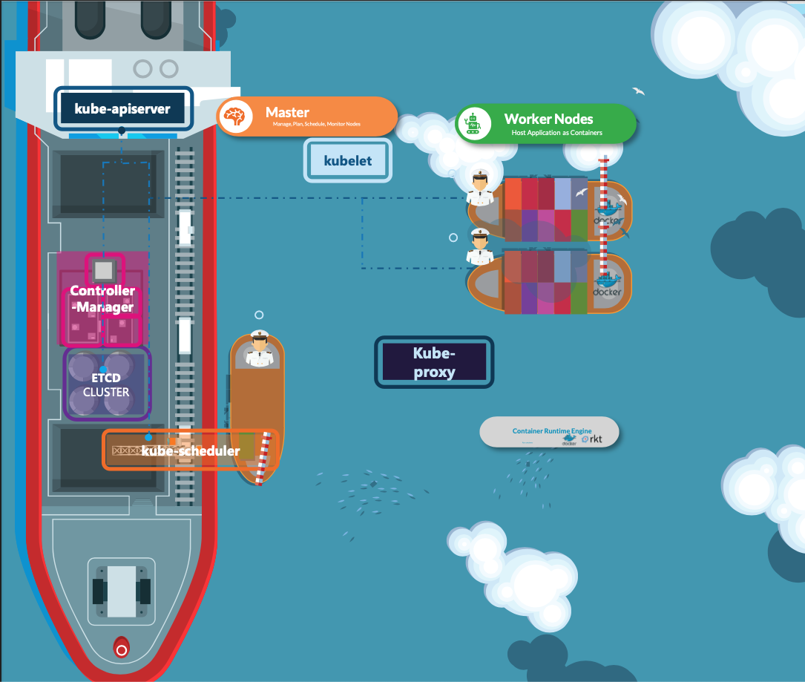
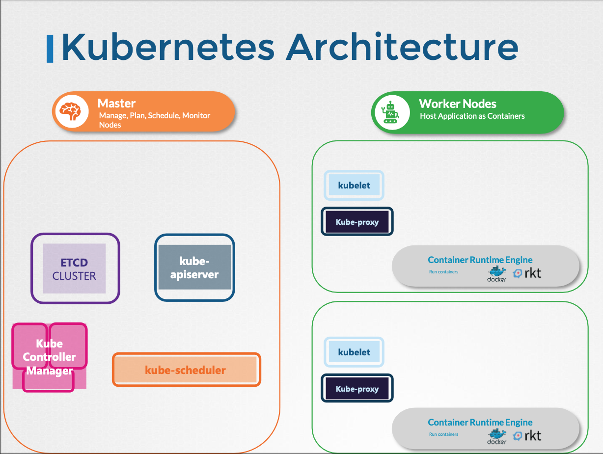

# Lecture 11 - Cluster Architecture

## **클러스터 구성 요소 비유**

- **화물선 (Cargo Ship)**: 컨테이너를 싣고 바다를 건너는 배.
    - **쿠버네티스 워커 노드(Worker Nodes)**
        - 컨테이너화된 애플리케이션(파드)을 호스팅하고 실행하는 실제 작업 공간.
        - 물리적, 가상, 온-프레미스 또는 클라우드 환경이 될 수 있다.
- **관제선 (Control Ship)**: 화물선을 감시하고 관리하는 배.
    - **쿠버네티스 마스터 노드(Master Node)**
        - 쿠버네티스 클러스터 전체를 관리하고, 노드 정보를 저장하며, 컨테이너 배치를 계획하고, 노드와 컨테이너를 모니터링하는 등 핵심적인 관리 작업을 담당.
        - 컨트롤 플레인(Control Plane) 구성 요소 집합을 통해 이 모든 작업을 수행.

## Kubernetes Architecture

쿠버네티스 클러스터는 크게 **마스터 노드(Master Node)**와 **워커 노드(Worker Nodes)**로 구성.

## 마스터 노드 (Master Node)

노드를 관리하고, 애플리케이션의 배포를 계획하고, 스케줄링하며, 모니터링하는 역할을 담당.

### 주요 구성 요소

**kube-apiserver**

- 쿠버네티스 API를 노출하는 핵심 컴포넌트입니다. 모든 통신의 중심점이며, 사용자와 클러스터 컴포넌트 간의 상호작용을 처리.
- 사용자 인증, 요청 검증, 데이터 검색 및 ETCD 업데이트 등의 기능을 수행.

**ETCD**

- 클러스터의 모든 데이터를 저장하는 분산형 키-값 저장소.
- 쿠버네티스 클러스터의 상태를 유지하는 백업 저장소 역할.
- 간단하고, 안전하며, 빠르고 신뢰할 수 있는 분산 시스템.
- `etcdctl` 명령어를 통해 키-값 설정 및 조회, 백업, 클러스터 상태 확인 등의 작업을 수행할 수 있다.

**Controller Managers**

- 클러스터의 상태를 지속적으로 모니터링하고, 현재 상태를 원하는 상태로 만들기 위한 변경 사항을 적용.
- 다양한 컨트롤러(예: Node Controller, Replication Controller, Deployment Controller, Namespace Controller, Endpoint Controller, Job Controller 등)를 포함.
- 노드 모니터링 주기, 그레이스 기간, 파드 제거 타임아웃 등의 설정이 있습니다.

**Kube Scheduler**

- 새로 생성된 파드를 실행할 워커 노드를 결정.
- 노드의 CPU, 메모리 등의 리소스 요구사항을 고려하여 가장 적합한 노드를 필터링하고 순위를 매긴다.

## 워커 노드 (Worker Nodes)

컨테이너화된 애플리케이션(파드)을 호스팅하고 실행하는 역할.

### 주요 구성 요소

**Kubelet**

- 각 노드에서 실행되는 에이전트로, 마스터 노드의 명령을 받아 파드를 실행하고 노드 및 파드의 상태를 모니터링하며 API 서버에 보고.
- 노드를 등록하고 파드를 생성하는 등의 역할.

**Kube Proxy**

- 각 노드에서 실행되는 네트워크 프록시로, 서비스 추상화를 구현하고 파드 간의 네트워크 통신을 관리.
- 서비스 IP 주소로 들어오는 요청을 파드로 라우팅.

**Container Runtime Engine**

- 컨테이너를 실행하는 소프트웨어입니다 (예: Docker, rkt)