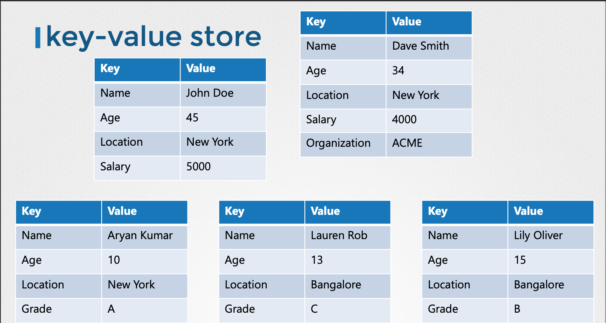

# Lecture14 - ETCD For Beginners

## ETCD 란?



- 분산되고 신뢰할 수 있는 Key-Value Store
- 단순하고 안전하며, 빠르다.
- Key-Value 스토어는 정보를 문서나 페이지 형태로 보관.
- 각 문서에 고유한 키(Key) 가 할당되고, 그 안에 모든 정보가 값(Value) 로 저장.
- 특정 문서만 업데이트하면 되므로 유연.
- 데이터가 복잡해지면 JSON 이나 YAML 같은 포맷 사용.

### Kubernetes 에서 ETCD 의 역할

Kubernetes **클러스터의 모든 데이터를 저장하는 백업 저장소** 역할.

### ETCD 설치 및 사용

- 바이너리 파일 다운만으로 쉽게 가능.
- 기본 포트 2379

```bash
$ curl -L https://github.com/etcd-io/etcd/releases/download/v3.3.11/etcd-v3.3.11-linux-amd64.tar.gz -o etcd-v3.3.11-linux-amd64.tar.gz

$ tar xzvf etcd-v3.3.11-linux-amd64.tar.gz

$ ./etcd

$ ./etcdctl set key1 value1

$ ./etcdctl get key1
value1

```

### ETCD 버전의 주요 변화

- **v0.x**: 2013년 8월, 최초 버전 출시.
- **v2.0**: 2015년 2월, RAFT 합의 알고리즘 재설계, 초당 1만 개 이상의 쓰기 지원.
- **v3.0**: 2017년 1월, 성능 최적화 및 향상.
    - **v2.0과 v3.0 사이의 API 및 커맨드 변화**. `etcdctl` 명령의 문법이 크게 변경.
    - v3에서는 `set` 명령이 `put` 변경.

### API v3 사용하기

- `etcdctl`의 기본 API 버전을 v3로 변경하려면, `ETCDCTL_API=3` 환경 변수를 설정해야 합니다.
- `export ETCDCTL_API=3` 명령으로 전체 세션에 적용