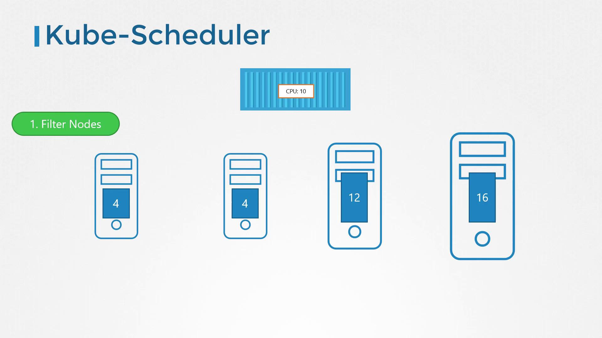
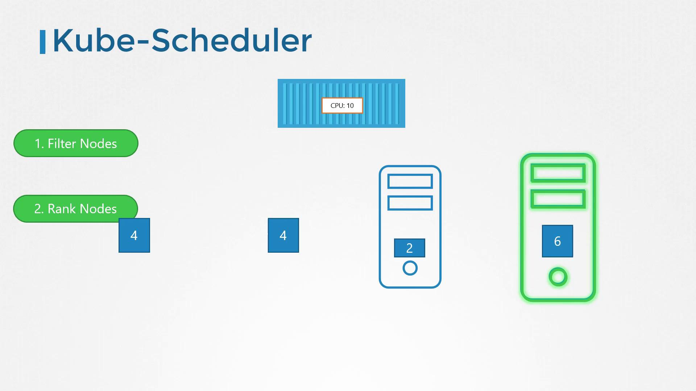

# Lecture 19 - Kube Scheduler

## Kube-Scheduler 역할

- kube-scheduler 는 생성된 파드에 가장 적합한 노드를 결정하고 할당하는 역할을 담당.
- kube-scheduler 는 파드에 노드를 "배치" 하는 것이 아니라, 파드가 배치될 "노드를 결정" 하는 역할.
- 실제 파드를 생성하는 것은 kubelet 의 역할.
- (비유: 스케줄러는 컨테이너를 어느 배에 실을지 결정하고, 선장(쿠벨렛)이 실제로 배에 싣는 것)
- 다양한 크기의 리소스 요구사항을 가진 파드를 효율적으로 관리하고, 특정 노드에 할당된 전용 애플리케이션 요구 사항(노드 셀렉ㄱ터, 어피니티 등) 을 충족시키기 위해 필요.

## Kube-Scheduler 과정

- Filtering

    

    - 스케쥴링의 첫 단계.
    - kube-scheduler 가 파드 요구 사항 (예: CPU, Memory)을 충족하지 못하는 노드를 걸러낸다.
    - 이 단계에서 파드를 실행할 수 없는 노드들은 후보군에서 제외된다.
- Ranking

    

    - 필터링된 노드들 중에서 가장 적합하 노드를 선택하기 위해 우선순위 함수를 사용하여 각 노드에 점수를 매긴다.
    - 예를 들어, 파드가 배치된 후 남게 될 리소스의 양을 계산하여 점수가 높은 노드를 선호.

## Kube-Scheduler 설치

### Binary 설치

```
$ wget <https://storage.googleapis.com/kubernetes-release/release/v1.13.0/bin/linux/amd64/kube-scheduler>

$ vi /etc/systemd/system/kube-scheduler.service

ExecStart=/usr/local/bin/kube-scheduler \\
  --config=/etc/kubernetes/config/kube-scheduler.yaml \\
  --v=2

```

### kubeadm 설치

- `kube-system` 마스터 노드의 네임스페이스에 파드로 배포된다.

```
# Pod 의 설정파일 경로
$ cat /etc/kubernetes/manifests/kube-scheduler.yaml

```