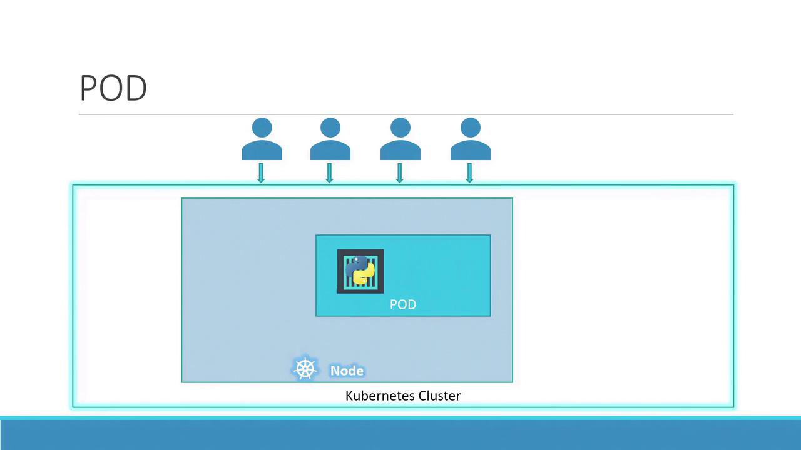
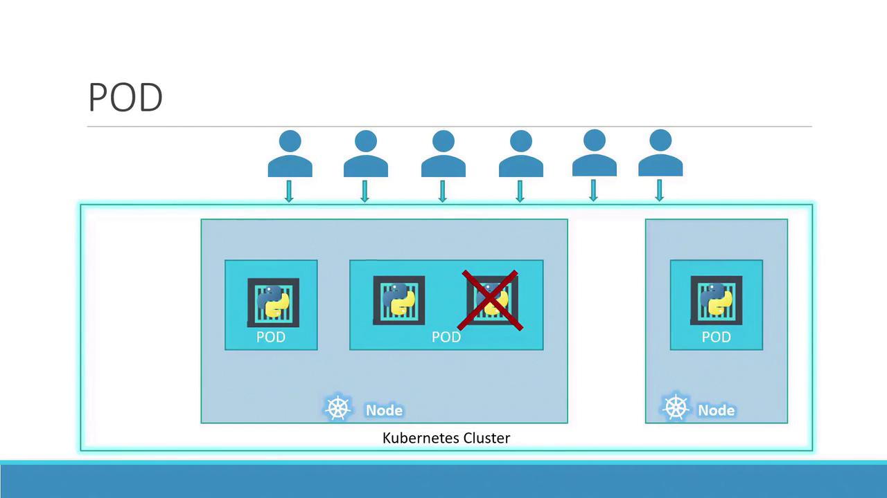
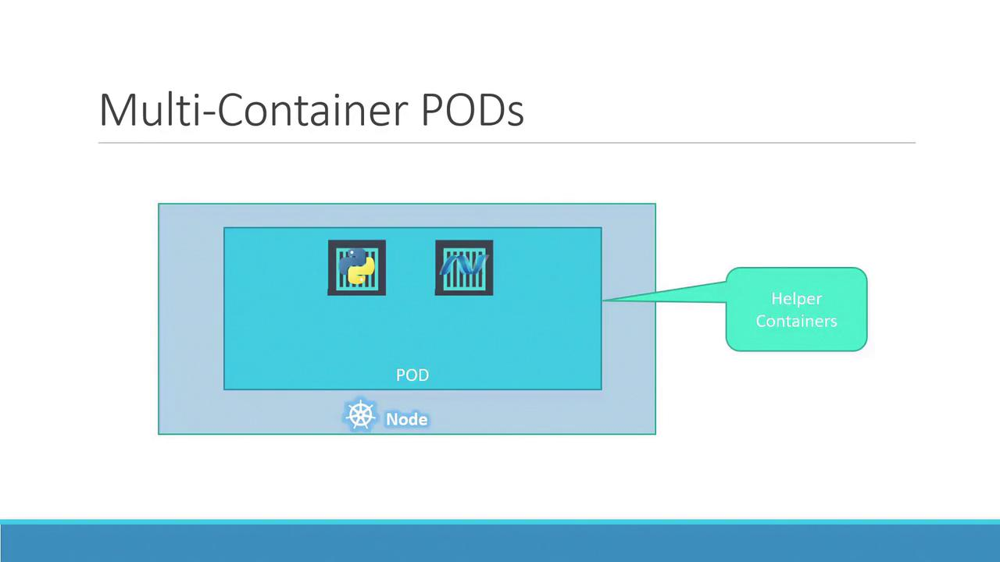

# Lecture 22 - Recap - Pods

## Pod



- 파드는 쿠버네티스에서 생성하고 관리할 수 있는 가장 작은 단위의 오브젝트이다.
- 에플리케이션의 단일 인스턴스를 나타낸다.
- 쿠버네티스는 컨테이너를 워커 노드에 직접 배포하지 않고, 파드라는 “캡슐” 안에 컨테이너를 담아서 배포한다.
- 일반적으올 파드는 컨테이너와 1:1 관계를 가진다.
- 즉, 하나의 파드 안에 하나의 컨테이너가 실행된다.
    - 이 방식을 사용하면 각 인스턴스가 격리되므로 쿠버네티스는 필요에 따라 사용 가능한 노드에 파드를 분산할 수 있다.
- 애플리케이션의 규모를 확장해야 할 경우, 기존의 파드에 컨테이너를 추가하지 않고, 새로운 파드를 추가로 생성한다.
- 반대로 규모를 축소할 경우 기존 파드를 제거한다.



## 다중 컨테이너 파드



- 파드는 여러 컨테이너를 포함할 수도 잇으며, 이러한 컨테이너는 일반적으로 중복되는 것이 아니라 상호 보완적이다.
- 예를 들어, 애플리케이션의 파일 처리에 대한 도우미 컨테이너를 사용하는 것이다.
- 하나의 파드에 있는 두 컨테이너는 동일한 네트워크 네임스페이스(localhost 를 통한 직접 통신 허용), 스토리지 볼륨 및 수명 주기 이벤트를 공유하여 함께 시작되고 종료된다.

## 파드 배포

- 파드를 배포하는 방벅은 `kubectl run` 명령어를 사용하는 것이다.

```bash
$ kubectl run nginx --image nginx

$ kubectl get pods

# Output after a few seconds:
# NAME                   READY   STATUS    RESTARTS   AGE
# nginx-8586cf59-whssr   1/1     Running   0          8s
```