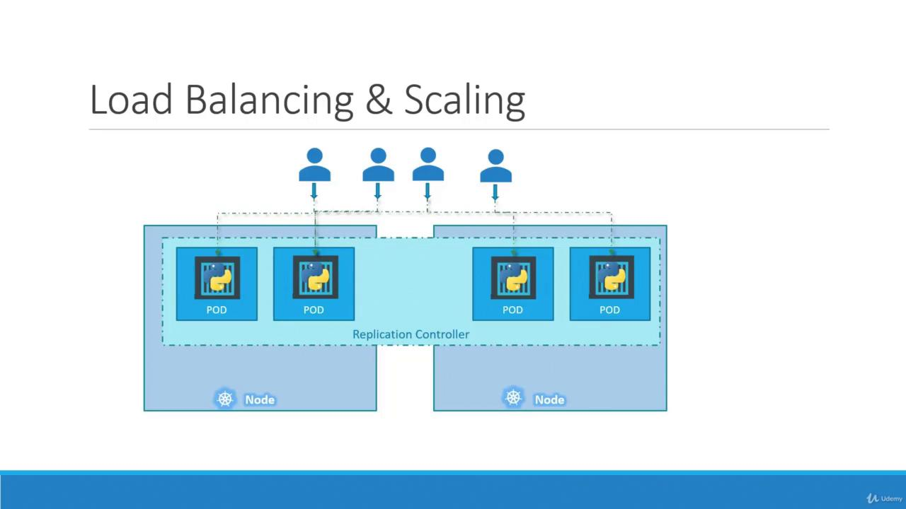

# Lecture29 - Recap - ReplicaSets

## Replication Controller

- 단일 파드가 애플리케이션을 실행하는 경우. 파드가 고장 나면 사용자가 애플리케이션에 접근할 수 없다.
- 이런 위험을 방지하기 위해서 여러 파드 인스턴스를 실행하는것이 중요하다.
- ReplicaSets 는 원하는 수의 파드 복제본을 생성하고 유지 관리하여 고가용성을 보장한다.
- 단일 파드를 실행하려는 경우에도 복제 컨트롤러(Replication Controller) 는 파드가 장애가 발생할 경우 자동으로 대체 파드를 생성하여 장애를 회피 할 수 있다.
- Replication Controller 는 파드에 문제가 발생하면 즉시 새로운 파드를 배포하여 서비스를 계속 사용할 수 있도록 한다.
- 즉, Replication Controller 는 원하는 수의 파드가 항상 실행되도록 보장한다.
- 또한, 사용자가 증가하면 여러 노드에 걸쳐 추가 파드를 생성하여 로드를 분산하고 애플리케이션 규모를 확장할 수 있다.



> Replication Controller 와 ReplicaSets 는 모두 유사한 목적을 수행한다.
>
> Replication Controller 는 점차 ReplicaSets 로 대체되고 있는 오래된 기술이다.
>

## Replication Controller 생성

```bash
$ vi rc-definition.yml

apiVersin: v1
kind: ReplicationController
metadata:
	name: myapp-c
	labels:
		app: myapp
		type: front-end
spec:
	replicas: 3
	template:
		metadata:
			name: myapp-pod
			labels:
				app: mypp
				type: front-end
		spec:
			containers:
			- name: nginx-container
				image: nginx
				
$ kubectl create -f rc-definition.yml

$ kubectl get replicationcontroller

NAME      DESIRED   CURRENT   READY   AGE
myapp-c   3         3         3       20s

$ kubectl get pods
NAME            READY   STATUS    RESTARTS   AGE
myapp-c-ls2xc   1/1     Running   0          39s
myapp-c-s545g   1/1     Running   0          39s
myapp-c-tf6xj   1/1     Running   0          39s
```

## ReplicaSet 생성

```bash
$ vi replicaset-definition.yml

apiVersion: apps/v1
kind: ReplicaSet
metadata:
  name: myapp-replicaset
  labels:
    app: myapp
    type: front-end
spec:
  replicas: 3
  selector:
    matchLabels:
      type: front-end
  template:
    metadata:
      name: myapp-pod
      labels:
        app: myapp
        type: front-end
    spec:
      containers:
      - name: nginx-container
        image: nginx
        
        
$ kubectl get replicaset

NAME               DESIRED   CURRENT   READY   AGE
myapp-replicaset   3         3         3       66s

$ kubectl get pods

NAME                     READY   STATUS    RESTARTS   AGE
myapp-replicaset-jccnh   1/1     Running   0          84s
myapp-replicaset-kflht   1/1     Running   0          84s
myapp-replicaset-sjnkp   1/1     Running   0          84s
```

## Labels 와 Selector

- `labels` 는 ReplicaSet 과 같은 컨트롤러가 대규모 클러스터 내에서 적절한 파드를 식별하고 관리할 수 있도록 해주는 결정 요소이다.
- 파드에 라벨을 붙이면 (ex: `app: frontend`), 클러스터 내 수많은 파드를 용도에 따라 쉽게 분류하고 식별할 수 있다.
- ReplicaSet 는 `selector` 를 통해 특정 라벨을 가진 파드를 선택하여 관리 대상을 지정한다.

> `template` 이 필요한 이유.
>

> 비록 기존 파드가 충분히 존재하더라도, 향후 파드 중 하나가 고장 났을 때 ReplicaSet 이 새로운 파드를 생성하여 수를 유지해야 하므로 `template` 섹션은 필수이다.
>

## ReplicaSet 확장

### definition.yml 파일 변경

```bash
$ vi replicaset-definition.yml

apiVersion: apps/v1
kind: ReplicaSet
metadata:
  name: myapp-replicaset
  labels:
    app: myapp
    type: front-end
spec:
  replicas: 6 # 3 -> 6
  selector:
    matchLabels:
      type: front-end
  template:
    metadata:
      name: myapp-pod
      labels:
        app: myapp
        type: front-end
    spec:
      containers:
      - name: nginx-container
        image: nginx
        
        
$ vi kubectl replace -f replicasete-definition.yml
```

### kubectl scale 명령어 사용

```bash
$ kubectl scale --replicas=6 -f replicaset-definition.yml
```

> 주의사항.
>
> `kubectl scale` 명령어를 사용하여 확장하는 경우 YAML 파일에는 기존의 replicaset 정의가 남아있기 때문에, 일관성을 유지하기 위해서는 YAML 파일을 수정하는것이 좋다.
>