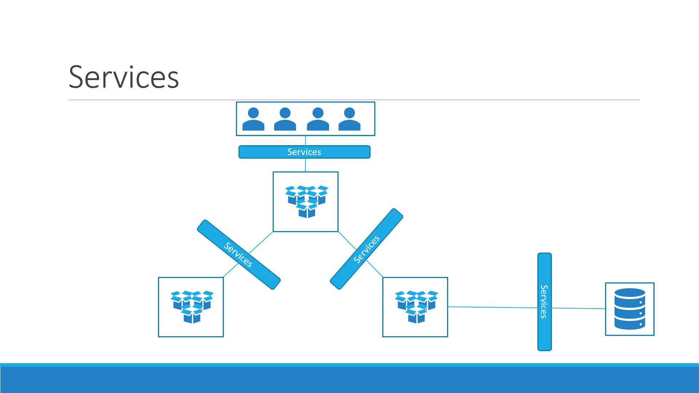
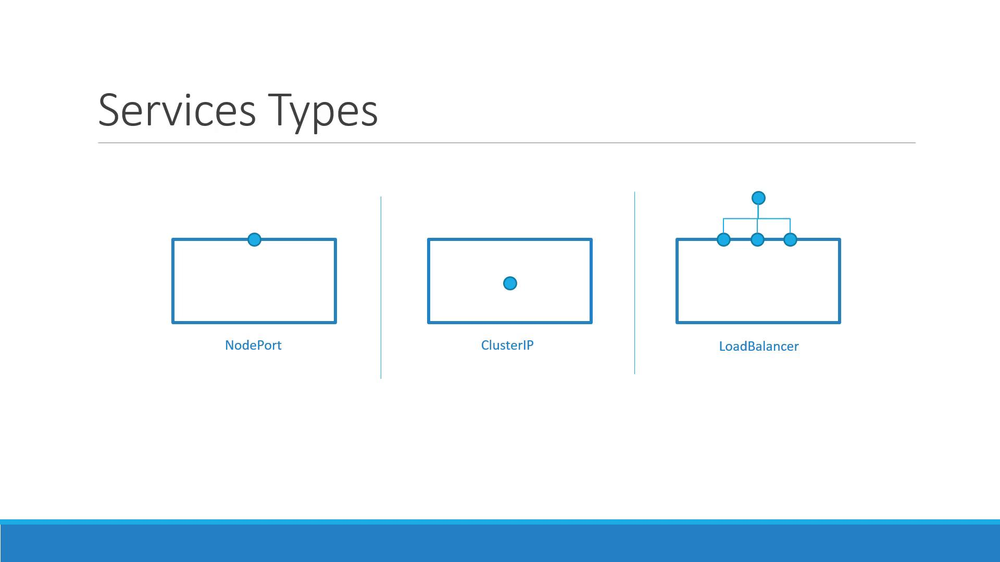

# Lecture37 - Service

## Kubernetes Service



- Service 는 프론트와 백엔드 파드 그룹 간의 통신.
- 백엔드와 외부 데이터 소스 간의 통신을 용이하게 한다.
- 외부 사용자가 클러스터 내부의 애플리케이션(파드)에 접근할 수 있도록 연결 통로를 제공한다.
- Service 는 안정적인 통신을 유지하면서 마이크로서비스를 분리하는 데 도움이 된다.


## 사용 사례: 내부 네트워킹에서 외부 접근

Kubernetes Node IP: 192.168.1.2
Laptop IP (same network): 192.168.1.10
Internal Pod Network: 10.244.0.0
Pod IP: 10.244.0.2

- Pod 는 격리된 내부 네트워크에 있으므로 Laptop 에서 10.244.0.2 에 직접 접속 불가.
- 쿠버네티스 Service 의 NodePort 를 통해 Pod 에 직접 접근이 가능하다.

``` bash
$ curl http://192.168.1.2:30008

Hello World!
```

## Service 유형



쿠버네티스는 다양한 통신 요구사항에 맞춰 세 가지 주요 Service 의 Type 을 제공한다.

- NodePort
  - 각 워커 노드의 특정 포트를 서비스 외부로 노출.
  - 사용자는 <NodeIP>:<NodePort> 로 애플리케이션 접근 가능.
  - NodePort 는 30000-32767 사이의 유효 범위 내에서 지정 가능.
- ClusterIP
  - 클러스터 내부에서만 접근 가능한 가상 IP를 서비스에 할당.
  - 클러스터 내부의 다른 서비스나 파드 간의 통신에 사용.
  - 외부에서는 접근 불가능
- LoadBalancer
  - 여러 Pod에 걸쳐 트래픽을 분산하기 위한 로드 밸런서를 제공.

## Service 생성

- Service 는 파드 정의 파일에 명시된 라벨(labels)을 기반으로 어떤 파드들을 관리할지 결정.
- Service 가 생성되면, selector에 일치하는 라벨을 가진 모든 파드를 자동으로 엔드포인트로 선택한다.
- Service 는 들어오는 외부 요청을 파드들로 라운드 로빈(Round Robin) 또는 무작위(Random) 분산.
- 파드가 제거되거나 추가되면 Serivce 가 자동으로 엔드포인트 목록을 업데이트하므로, 별도의 설정 변경이 필요 없다.


```bash

$ vi pod-definition.yaml

apiVersion: v1
kind: Pod
metadata:
  name: myapp-pod
  labels:
    app: myapp
    type: front-end
spec:
  containers:
    - name: nginx-container
      image: nginx

$ vi service-definition.yaml

apiVersion: v1
kind: Service
metadata:
  name: myapp-service
spec:
  type: NodePort
  ports:
    - targetPort: 80 # 지정하지 않을 경우 port 와 동일한 값으로 간주.
      port: 80 # 필수 속성
      nodePort: 30008 # 지정하지 않을 경우 유효한 범위 내 자동 할당.
  selector:
    app: myapp
    type: front-end

$ curl localhost:30008

<!DOCTYPE html>
<html>
<head>
<title>Welcome to nginx!</title>
<style>
html { color-scheme: light dark; }
body { width: 35em; margin: 0 auto;
font-family: Tahoma, Verdana, Arial, sans-serif; }
</style>
</head>
<body>
<h1>Welcome to nginx!</h1>
<p>If you see this page, the nginx web server is successfully installed and
working. Further configuration is required.</p>

<p>For online documentation and support please refer to
<a href="http://nginx.org/">nginx.org</a>.<br/>
Commercial support is available at
<a href="http://nginx.com/">nginx.com</a>.</p>

<p><em>Thank you for using nginx.</em></p>
</body>
</html>

```

### 개인 궁금증

> 궁금증 - 세 가지 서비스 타입을 모두 사용하기 위한 서비스 정의
> - Service Type 은 계층적인 관계 : ClusterIP < NodePort < LoadBalancer
> - ClusterIP: 클러스터 내부에서만 접근 가능한 가상 IP 할당
> - NodePort: ClusterIP 의 기능을 포함하며, 추가로 각 노드의 특정 포트를 통해 서비스를 외부에 노출
> - LoadBalancer: NodePort 와 ClusterIP 의 기능을 모두 포함하며, 각 요청을 알맞을 Pod 로 로드 밸런싱을 통해 부하 분산.

> 궁금증 - Service 의 부하 분산 알고리즘은 어떻게 결정하는지
> - kube-proxy 의 동작 모드에 따른 차이가 발생한다.
> - `iptables` (기본) - 무작위(Random) 방식. iptables 규칙을 이용한 트래픽 전달 방식.
> - `IPVS` (권장) - 라운드 로빈(Round Robin)(기본값), 최소 연결(Least Connection), 가중치 라운드 로빈(Weighted Round Robin) 등 다양한 알고리즘 지원. 리눅스 커널에 내장된 고성능 부하 분산 기능.
> - `userspace` (구식) - 라운드 로빈(Round Robin) 방식. kube-proxy 가 사용자 공간에 동작하는 구식 모드로 성능이 낮다.
