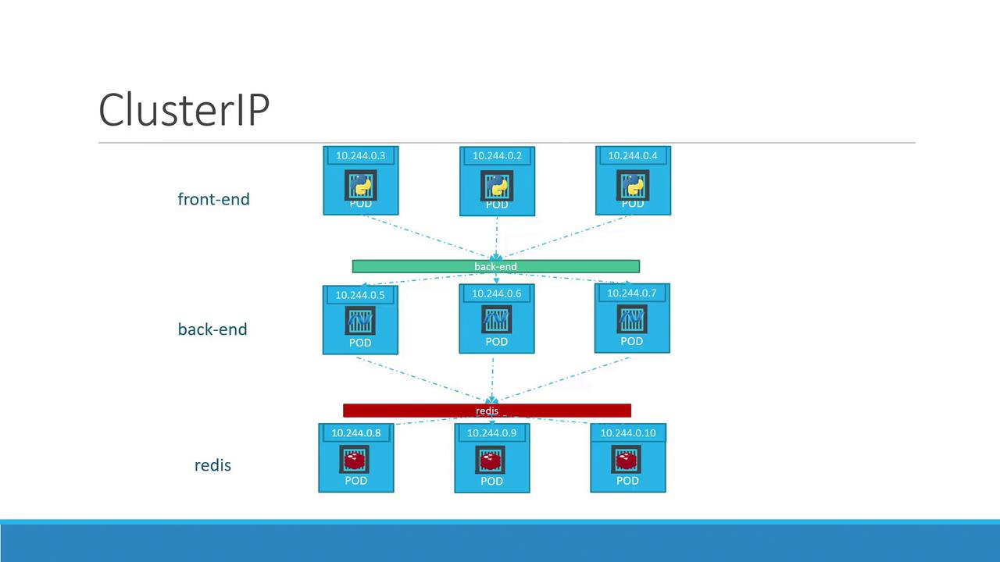

# Lecture 38 - Services Cluster IP



## Cluster IP

- 마이크로서비스 애플리케이션은 다양한 역할의 Pod 들이 여러개 구성된다.
- 파드는 재생성 시 변경될 수 있는 동적 IP 주소를 수신하기 때문에 내부에서 이러한 IP 를 사용하는 것은 비효율적이다.
- 쿠버네티스는 관련 파드를 단일 서비스로 그룹화 하여 해당 문제를 해결한다.
- Service 는 고정된 클러스터 IP 또는 Service Name 을 제공하여, 파드의 개별 IP 를 신경쓰지 않고 엑세스 할 수 있도록 한다.
- 또한,  수신 요청의 부하를 사용 가능한 파드에 자동으로 분산 처리를 한다.

> **NOTE**
> 쿠버네티스의 각 서비스는 클러스터 내에서 자동으로 IP 와 DNS 이름을 할당 받는다.
> Cluster IP 는 다른 파드가 서비스에 엑세스할 때 사용되며, 이를 통해 일관되고 안정적인 연결을 보장한다.

## Backend Service Example

```bash

$ vi service-definition.yaml

apiVersion: v1
kind: Service
metadata:
  name: back-end
spec:
  type: ClusterIP
  ports:
    - port: 80
      targetPort: 80
  selector:
    app: myapp
    type: back-end
```


# Lecture 39 - Service LoadBalancer

## Service LoadBalancer

- NodePort 는 모든 노드의 IP 주소와 특정 포트 (NodePort) 를 통해 애플리케이션에 접근할 수 있게 한다.
- 만약, 2개의 이상의 Pod 가 각각 다른 노드를 사용중에 있다면 사용자가 여러 개의 `IP:PORT` 조합을 기억해야 하므로 불편하다.
- 추가로, 외부 Load Balancer (HAProxy, Nginx) 가 필요하게 되므로 관리의 복잡성과 오버헤드가 증가한다.
- AWS, GCP, Azure 와 같은 클라우드 환경에서 `type: LoadBalancer` 를 사용할 경우, Cloud Provider 의 로드 밸런서를 자동으로 프로비저닝하고 구성해준다.
- 이를 통해 퍼블릭 클라우드 환경에서 손쉽게 단일 진입점을 구성할 수 있다.

## Service LoadBalancer 동작 방식

- 클라우드 서비스의 로드 밸런서가 외부 트랙픽을 요청 받는다.
- 요청 받은 트래픽을 쿠버네티스 클러스터 내부의 워커 노드로 분산한다.
- 각 워커 노드에 도착한 트래픽은 `NodePort` 를 통해 각 애플리케이션에 전달된다.

### 개인 궁금증

> 궁금증 - Public Cloud 가 아닌 On-Premise 환경의 쿠버네티스의 경우 Service 의 LoadBalancer 기능을 사용하지 못하나?
> 
> 결론: Service 의 LoadBalancer 기능은 클라우드 서비스를 위해서 만들어진 기능이 맞다. 즉, On-Premise 환경에서는 일반적으로 사용이 불가능하다.
>
> `LoadBalancer` 서비스를 생성하면 Cloud Controller Manager 가 Cloud Provider API 를 호출하여 외부에 노출할 LoadBalancer 를 자동으로 생성 및 준비한다.
> 따라서, On-Premise 환경에서는 동작하지 않는다.

> 궁금증 - 그렇다면 On-Premise 환경에서 서비스 LoadBalancer 는 어떻게 구성하는가
> 1. 외부 레이어에 HAProxy 나 Nginx 같은 LoadBalancer 를 직접 구성하는 방법.
> 2. MetalLB
>   - `MetalLB` 는 베어 메탈(온프레미스) 쿠버네티스 클러스터를 위한 로드 밸런서 솔루션.
>   - 클러스터 내에서 자체적으로 로드 밸런서 기능을 구현하여 `LoadBalancer` 서비스 타입이 클라우드 환경처럼 동작할 수 있게 해줌.
>   - MetalLB 는 클러스터 내부에 설치되며, 외부 IP 주소 풀을 관리하고 ARP 또는 BGP 를 사용하여 외부 트래픽을 라우팅.

> 궁금증 - ARP, BGP 개념
> 1. ARP (Address Resolution Protocol)
>   - 로컬 네트워크(동일한 LAN) 내에서 IP 주소를 MAC 주소로 변환하는 프로토콜.
>   - MetalLB 에서는 특정 서비스에 할당된 IP 주소를 노드의 MAC 주소로 응답하여 서비스 트래픽을 해당 노드로 전달.
>   - 징점
      >     - 설정이 간단하고, 대부분의 네트워크 환경에서 추가적인 설정 없이 동작.
>   - 단점
      >     - 로컬 네트워크 내에서만 동작하며, 노드 장애 발생 네트워크 재설정 시간이 필요할 수 있다.
> 2. BGP (Border Gateway Protocol)
     >   - 인터넷에서 라우터들이 서로 경로 정보를 교환 하는데 사용하는 프로토콜.
>   - MetalLB 가 BGP 모드로 동작할 때, 클러스터 내의 노드는 BGP Peer 로 동작하며, 서비스에 할당된 외부 IP 주소를 "경로 정보"로 외부에 있는 라우터에 알린다.
>   - 외부 라우터는 이 정보를 받아 트래픽을 클러스터 노드들 중 하나로 전달한다.
>   - 장점
>     - 대규모 네트워크 환경에 적합하다.
>     - 라우터 간의 경로 정보 교환을 통해 트래픽을 여러 노드로 효율적으로 분산한다.
>     - 노드 장애 시에도 신속하게 트래픽 경로 변경이 가능하다.
>     - L3(네트워크 계층) 에서 동작하므로, 로컬 네트워크를 넘어서 더 넓은 네트워크 환경에서 사용 가능하다.
>   - 단점
>     - 네트워크 라우터에 BGP 를 설정해야 하므로, 네트워크 추가적인 설정이 필요하다.