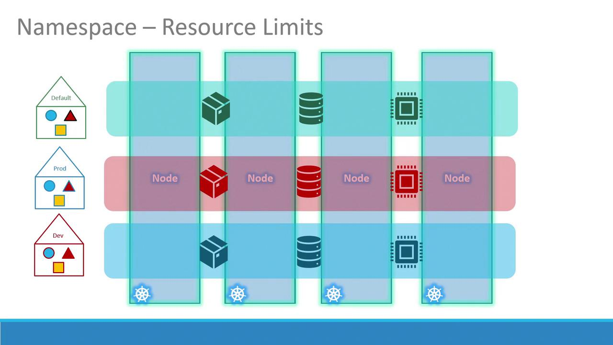

# Lecture 39 - Namespaces

## Namespace

- namespace 는 클러스터 내의 리소스를 여러 그룹으로 나누어 관리하는 가상의 공간이다.
- namespace 는 쿠버네티스의 기본 구성 요소로, 리소스를 효과적으로 분할하고 관리할 수 있도록 한다.
- 시스템 구성 요소를 격리하거나 개발 환경과 운영 환경을 분리할 때, 적절한 정책 및 리소스 할당량과 함께 네임스페이스를 사용하면 더욱 효율적이고 체계적인 클러스터 관리가 가능하다.
- namespace 를 통해 여러 팀이나 환경(예: 개발, 프로덕션)이 동일한 클러스터에서 서로 간섭 없이 리소스를 사용할 수 있다.
- 기본 네임스페이스로는 쿠버네티스 클러스터 설정 과정에서 자동을 생성된다.
    - default
        - 별도로 지정하지 않으면 모든 리소스가 기본적으로 생성되는 공간.
    - kube-system
        - 쿠버네티스 시스템 구성 요소가 실행되는 공간.
    - kube-public
        - 모든 사용자가 공개적으로 접근할 수 있어야 되는 리소스를 위한 공간.

## Namespace 를 이용한 리소스 격리

- 네임스페이스를 사용하면 각 환경에 대해 고유한 정책과 리소스 제한을 설정할 수 있다,
- 이러한 격리를 통해 한 네임스페이스가 다른 네임스페이스를 방해하는 것을 방지할 수 있다.
- 예를 들어, CPU, 메모리 및 총 Pod 수에 대해 별도의 리소스 할당량을 적용하여 환경 간 공평한 사용을 보장할 수 있다.



- 단일 네임스페이스 내에서 리소스는 간단한 이름을 통해 서로를 직접 참조할 수 있다.
- 예를 들어, 기본 네임스페이스의 웹 애플리케이션 포드는 서비스 이름만 사용하여 데이터베이스 서비스에 액세스할 수 있다.
- 웹 앱 포드가 다른 네임스페이스에 있는 서비스와 통신해야 하는 경우, 해당 서비스의 정규화된 DNS 이름을 사용해야 한다.
- 예를 들어, "dev" 네임스페이스에 있는 "db-service"라는 데이터베이스 서비스에 연결하는 형식은 다음과 같다.

```
mysql.connect("db-service.dev.svc.cluster.local")
```

## kubectl 을 사용한 네임스페이스 관리

- kubectl 을 사용하여 여러 네임스페이스의 리소스를 관리할 수 있다.

```bash
$ kubectl get pods --namespace=kube-system

NAME                                      READY   STATUS      RESTARTS       AGE
coredns-ccb96694c-7tp2q                   1/1     Running     10 (41d ago)   151d
helm-install-traefik-4nrn5                0/1     Completed   1              151d
helm-install-traefik-crd-wfl8b            0/1     Completed   0              151d
local-path-provisioner-5b5f758bcf-j4qqr   1/1     Running     10 (41d ago)   151d
metrics-server-7bf7d58749-9gbbd           1/1     Running     11 (41d ago)   151d
svclb-traefik-abf5bcd3-h9zg5              2/2     Running     20 (41d ago)   151d
traefik-5cbdcf97f4-drqzx                  1/1     Running     10 (41d ago)   151d

$ kubectl create -f pod-definition.yml --namespace=dev

```

- Pod 정의시 아래와 같이 네임스페이를 명시적으로 선언할 수 있다.

```bash
$ vi dev-pod.yaml

apiVersion: v1
kind: Pod
metadata:
  name: myapp-pod
  namespace: dev
  labels:
    app: myapp
    type: front-end
spec:
  containers:
    - name: nginx-container
      image: nginx

```

## Namespace 생성

```bash

$ vi namespace-dev.yml

apiVersion: v1
kind: Namespace
metadata:
  name: dev

$ kubectl create -f namespace-dev.yml

```

## Context 기본 네임스페이스 설정

- 컨텍스트는 단일 구성 내에서 여러 클러스터와 사용자 환경을 관리하는 데 사용
- 네임스페이스 전환은 간단하지만, 컨텍스트 관리는 더 광범위한 주제이므로 심도 있는 연구가 필요
- 여러 네임스페이스에서 작업하고 네임스페이스 플래그를 반복적으로 지정하지 않으려면 현재 컨텍스트에 대한 기본 네임스페이스를 설정할 수 있다.

```bash

$ kubectl config set-context $(kubectl config current-context) --namespace=dev

# 모든 네임스페이스 조회
$ kubectl get pods --all-namespaces

```

## ResourceQuotas를 사용하여 리소스 사용 제어

- compute-quota.yaml단일 네임스페이스가 클러스터 리소스를 과도하게 소모하지 않도록 Kubernetes에서는 ResourceQuotas를 정의할 수 있다.

```bash

$ vi compute-quota.yaml

apiVersion: v1
kind: ResourceQuota
metadata:
  name: compute-quota
  namespace: dev
spec:
  hard:
    pods: "10"
    requests.cpu: "4"
    requests.memory: 5Gi
    limits.cpu: "10"
    limits.memory: 10Gi

$ kubectl create -f compute-quota.yaml

```