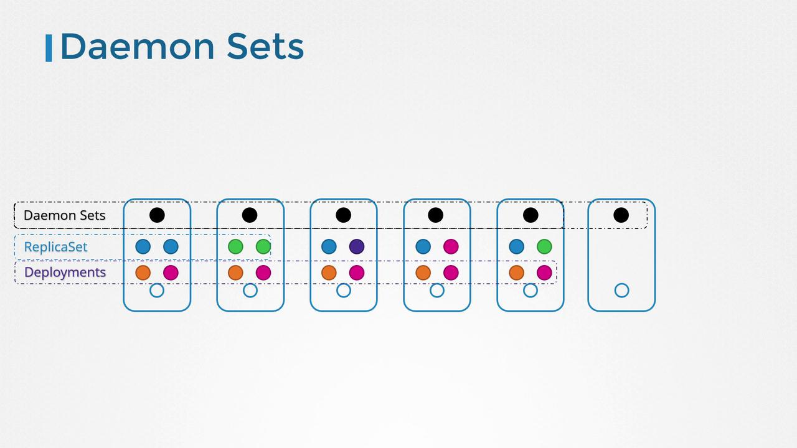
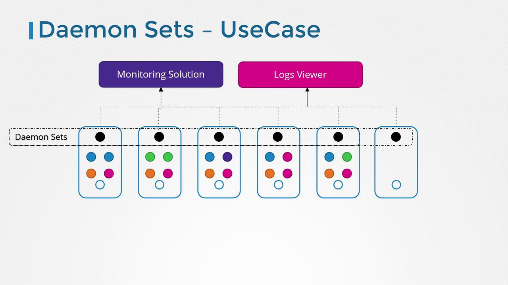

# Lecture 73 - Daemon Sets

## Daemon Sets



- DaemonSet 은 쿠버네티스 클러스터의 모든 노드에서 정확히 하나의 Pod 사본이 실행되도록 보장한다.
- 새 노드를 추가하면 DaemonSet 이 자동으로 새 노드에 Pod 에 배포한다.
- 노드가 제거되면 해당 Pod 도 제거된다.
- 이를 통해 각 노드에서 단일 Pod 인스턴스를 지속적으로 사용할 수 있다.
- DaemonSets 은 주요 서비스가 쿠버네티스 클러스터 전체에 균일하게 배포되도록 보장하는 효율적인 매커니즘을 제공한다.
- 쿠버네티스 동적 환경에서 일관성과 안정성을 유지하는데 도움을 준다.

## DaemonSets 의 사용 사례



- DaemonSets 는 모든 노드에서 백그라운드 서비스나 에이전트를 실행해야 하는 경우 유용하다.
    - 모니터링 에이전트 및 로그 수집기
        - 모든 노드에 모니터링 도구나 로그 수집기를 배포하여 수동 개입 없이 클러스터 전체의 포괄적인 가시성을 보장한다.
    - Kubernetes 의 필수 구성 요소
        - Kubernetes 에 필요한 `kube-proxy` 와 같은 중요한 구성 요소를 모든 워커 노드에 배포.
    - 네트워킹 솔루션
        - `Vnet` , `weave-net` 과 같은 네트워킹 에이전트를 모든 노드에 일관되게 배포하기 위해 사용.

## DaemonSet 생성

```bash
$ vi monitoring-daemon.yaml

apiVersion: apps/v1
kind: DaemonSet
metadata:
	name: monitoring-daemoon
spec:
	selector:
		matchLabels:
			app: monitoring-agent
		template:
			metadata:
				labels:
					app: monitoring-agent
			spec:
				containers:
				- name: monitoring-agent
					image: monitoring-agent

$ vi kubectl create -f monitoring-daemon.yaml
```

- `selector` 에 `matchLabels` 가  Pod 의 `label` 과 일치해야 한다.

## DaemonSet 가 Pod 를 예약하는 방법

- 1.12 버전 이전
    - 특정 노드에 파드를 스케쥴링하기 위해 `nodeName` 속성에 수동으로 설정.
- 1.12 버전 이후
    - 기본 스케쥴러와 Node Affinity 규칙을 함께 사용.
    - 수동 개입 없이 모든 노드에 파드가 자동으로 스케줄링.