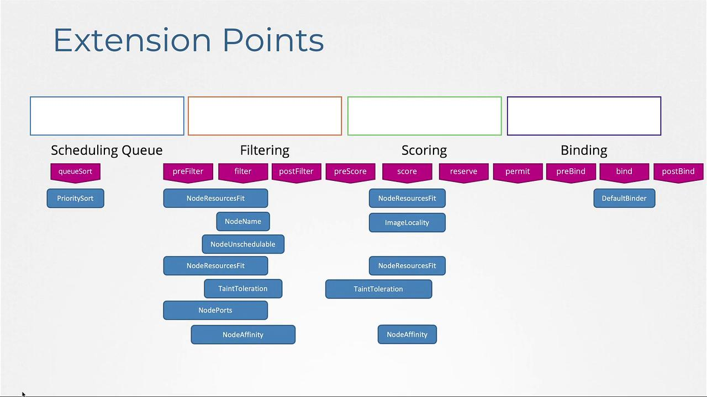

# Lecture 84 - Configuring Scheduler Profiles

## 스케줄러 동작 방식

1. Filter Phase
- 파드의 리소스 요구 사항을 충족할 수 없는 (ex: 리소스가 부족한 노드) 는 필터링 되어서 제외된다.
1. Scoring Phase
- 남은 노드에 필요한 리소스를 예약한 후 리소스 가용성에 따라 점수를 매긴다.
1. Binding Phase
- Scoring Phase 단계에서 가장 점수가 높은 노드에 파드가 할당된다.

## Key Scheduler Plugins



- 이러한 동작 방식에서 여러개의 스케줄러 플러그인은 각 단계에서 중요한 역할을 한다.
- 쿠버네티스는 확장성을 강조하며, Queueing, Filtering, Scoring, Binding 단계를 플러그인 통해 수정할 수 있다.

Priority Sort Plugin

- 스케줄링 대기열에 있는 포드를 우선수위 따라 정렬.

Node Resources Fit Plugin

- 필요한 리소스가 없는 노드 필터링

Node Name Plugin

- 포드 spec 에서 특정 nodeName 을 확인하고, 그에 따라 노드 필터링

Node Unschedulable Plugin

- 예약 불가로 표시된 노드 제외. `Unschedulable: true`

## Profile 을 이용한 스케줄러 동작 커스터마이징

- 쿠버네티스 1.18 에서 단일 스케줄러 바이너리 내에서 여러 스케줄러 profile 을 지원.
- 이러한 접근방식은 운영 오버헤드를 최소화하고, 여러 프로세스가 동일한 노드에서 워크로드를 스케줄링할 때 발생할 수 있는 경합 상태를 방지.
- 다양한 플러그인을 선택적으로 활성화, 비활성화를 통해 요구사항에 맞게 스케줄링 동작을 조정 가능.

```bash
apiVersion: kubescheduler.config.k8s.io/v1
kind: KubeSchedulerConfiguration
profiles:
  - schedulerName: my-scheduler-2
    plugins:
      score:
        disabled:
          - name: TaintToleration
        enabled:
          - name: MyCustomPluginA
          - name: MyCustomPluginB
  - schedulerName: my-scheduler-3
    plugins:
      preScore:
        disabled:
          - name: '*'
      score:
        disabled:
          - name: '*'
  - schedulerName: my-scheduler-4

```