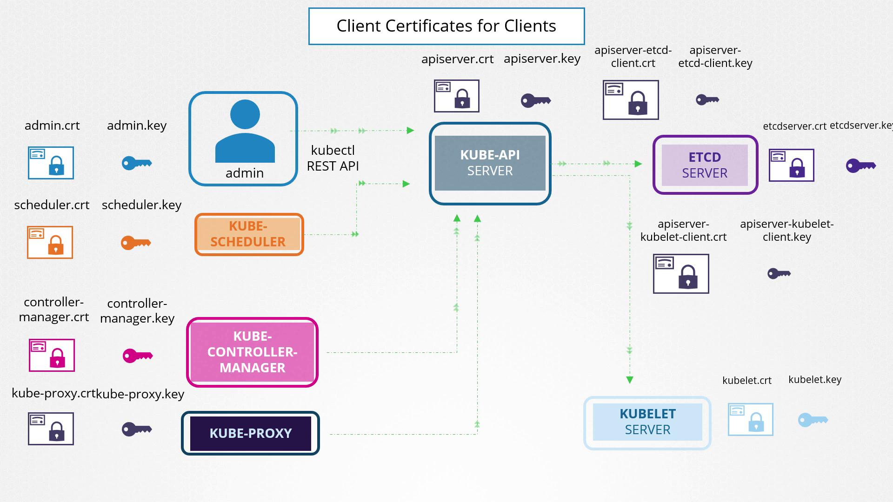

# Lecture 160 - TLS in kubernetes

## 명명 규칙

- 인증서 파일은 특정 명명 규칙을 따른다.
- 공개 키 인증서는 일반적으로 `.cert`, `.pem` 확장자를 갖는다.
    - ex: `server.cert`, `server.pem`, `client.cert`, `client.pem`
- 개인 키는 일반적으로 파일 이름이나 확장자에 `key` 단어가 포함된다.
    - ex: `server.key`, `server-key.pem`

## Kubernetes 클러스터의 TLS 인증서

- 쿠버네티스 클러스터는 안전하고 암호화된 통신이 필요한 마스터 노드와 워커 노드로 구성된다.
- 관리자가 `kubectl` 유틸리티를 사용하여 연결하든 쿠버네티스 API 와 직접 상호 작용하든 안전한 TLS 연결은 필수적이다.

## Kubernetes 구성 요소와 관련 인증서 구성

- 여러 구성 요소는 클라이언트로 작동하며 `Kube API Server` 에 연결할 때 인증이 필요하다.

### Kube API Server

- API 서버는 클러스터 관리를 위한 `HTTPS` 서비스를 제공한다.
- 서버 역할을 하며 자체 인증서와 키 쌍이 필요하다.

### ETCD 서버

- 모든 클러스터 정보의 데이터 저장소 역할을 하는 ETCD에는 고유한 인증서와 키 쌍이 필요하다.

### Worker Node의 Kubelet

- 각 Worker Node 에서 Kubelet 서비스는 모니터링 및 관리를 위해 API 서보와 통신하는 `HTTPS` 엔드포인트를 제공한다.
- 자체 인증서와 키 쌍을 사용한다.

## 클라이언트 구성 요소 및 해당 인증서

### 관리자(kubectl/REST API)

- 관리자 사용자는 클라이언트 인증서와 키 쌍을 사용하여 API 서버에 대한 보안 연결을 설정한다.

### Scheduler Pod

- 스케줄링을 관리하는 스케줄러는 API 서버와 상호 작용하기 위해 자체 클라이언트 인증서가 필요하다.

### Kube Controller Manager

- API 서버에 대한 요청을 인증하기 위해 전용 인증서 쌍이 필요하다.

### Kube Proxy

- 클러스터 내에서 네트워크 라우팅을 처리하는 Proxy 는 API 서버와 통신을 위해 클라이언트 인증서를 사용한다.

### Kube API Server

- API 서버는 ETCD 서버와 kubelet 간의 안전한 통신을 지원한다.
- API 서버는 HTTPS 서비스 인증서를 재사용하거나 전용 인증서 쌍을 사용할 수 있다.

## 향상된 관리를 위한 인증서 그룹화

- 인증서 관리를 보다 쉽게하기 위해 TLS 인증서를 두 가지 주요 범주로 그룹화할 수 있다.
- 모든 인증서는 인증 기관에서 서명해야 한다.
- 쿠버네티스 클러스터에는 최소 하나의 CA 가 필요하지만, 추가적인 분리를 위해 여러 CA 를 사용할 수도 있다.

### 클라이언트 인증서

- API 서버를 인증하는데 사용.
    - Admin, Scheduler, Controller Manager, Kube-Proxy 에서 사용 가능.

### 서버 인증서

- 서비스를 보호하는 데 사용.
    - Kube API Server, ETCD, Kubelet 에서 사용 가능.