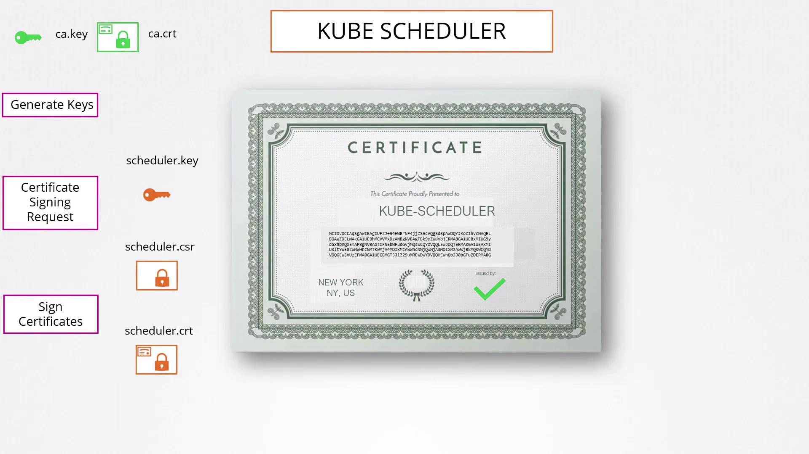
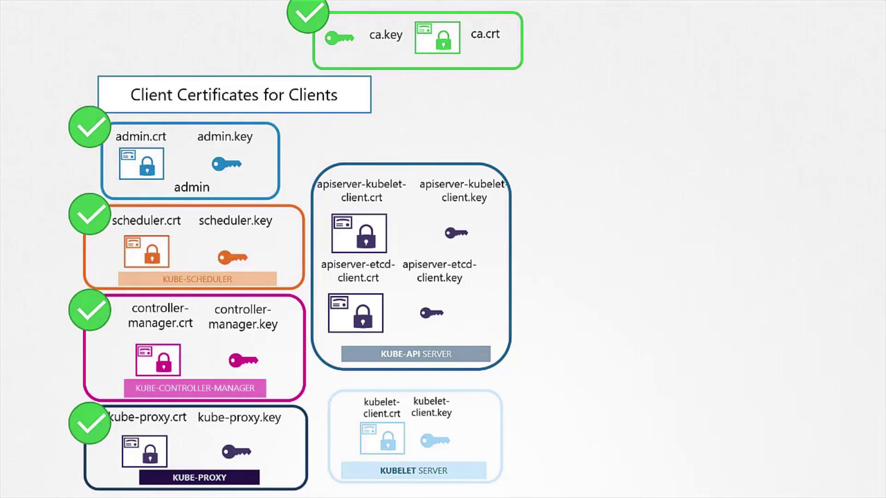
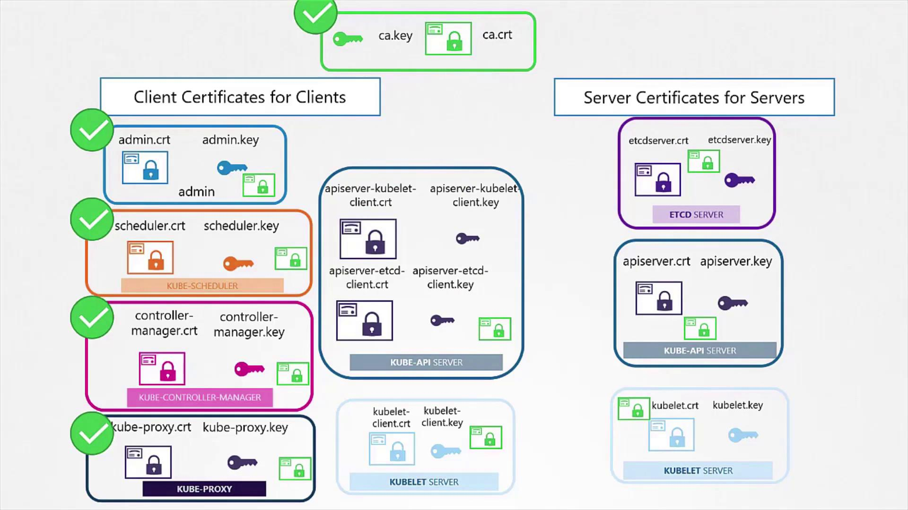

# Lecture 161 - TLS in Kubernetes Certificate Creation

## 쿠버네티스 클러스터의 TLS 인증서 생성

- `EasyRSA`, `CFSSL` 과 같은 인기 도구도 존재하지만, 여기서는 `OpenSSL` 을 사용해서 진행.

## 1. CA 인증서 생성

- CA 인증서를 `openssl` 명령어를 통해 생성한다. (개인 키 - `ca.key`, 루트 인증서 - `ca.crt`)
- 해당 키는 다른 인증서 서명하는데 필수적이며, 안전하게 보호되어야 한다.

```bash
$ openssl genrsa -out ca.key 2048
$ openssl req -new -key ca.key -subj "/CN=KUBERNETES-CA" -out ca.csr
$ openssl x509 -req -in ca.csr -signkey ca.key -out ca.crt
```

## 2. 클라이언트 인증서 생성

- 관리자 사용자 인증서 발급이 필요하다.
- 그룹을 반영하기 위해 일반 이름(CN) 과 조직단위(OU) 를 지정하여 관리자용 CSR 을 생성한다 (`system:masters`).
- 이러한 일관성을 통해 관리자 ID가 검사 추적에 올바르게 기록되고 `kubectl` 명령에서 인식된다.
- 최종 관리자 인증서를 생성하려면 CA 인증서로 관리자 CSR에 서명한다.
- 생성된 `admin.crt` 파일은 쿠버네티스 API 서버에서 관리자를 인증하기 위한 사용자 이름과 비밀번호 쌍과 유사한 보안 자격 증명 역하을 한다.
- Scheduler, Controller Manager, kube-proxy 등의 다른 구성 요소에 대한 클라이언트 인증서를 생성하는 데도 비슷한 프로세스로 적용한다.

```bash
$ openssl genrsa -out admin.key 2048
$ openssl req -new -key admin.key -subj "/CN=kube-admin/O=system:masters" -out admin.csr
$ openssl x509 -req -in admin.csr -CA ca.crt -CAkey ca.key -out admin.crt

```



## 3. API 요청에서 클라이언트 인증서 사용

- 클라이언트 인증서를 사용함으로써 `REST API` 호출 시 사용자 이름과 비밀번호를 사용할 필요가 없다.

```bash
$ curl <https://kube-apiserver:6443/api/v1/pods> \\
--key admin.key --cert admin.crt --cacert ca.crt

```



## 4. 서버 측 인증서

- 안전한 통신을 위해 클라이언트 인증서와 서버 인증서 모두 동일한 CA 루트 인증서를 신뢰해야 한다.
- 이 인증서는 양 당사자가 수신한 인증서의 진위 여부를 확인하는 데 사용된다.




### 4.1 Etcd 서버 인증서

- 고가용성 구성의 핵심 구성 요소인 etcd 서버에도 인증서가 필요하다.
- etcd가 클러스터로 실행되는 경우, 구성원 간 통신을 보호하기 위해 피어 인증서를 생성해야 한다.
- 생성된 인증서는 etcd 구성 파일(일반적으로 etcd.yaml)에서 참조된다.

```bash
$ cat etcd.yaml

- --advertise-client-urls=https://127.0.0.1:2379
- --key-file=/path-to-certs/etcdserver.key
- --cert-file=/path-to-certs/etcdserver.crt
- --client-cert-auth=true
- --data-dir=/var/lib/etcd
- --initial-advertise-peer-urls=https://127.0.0.1:2380
- --initial-cluster=master=https://127.0.0.1:2380
- --listen-client-urls=https://127.0.0.1:2379
- --listen-peer-urls=https://127.0.0.1:2380
- --name=master
- --peer-cert-file=/path-to-certs/etcdpeer1.crt
- --peer-client-cert-auth=true
- --peer-key-file=/etc/kubernetes/pki/etcd/peer.key
- --peer-trusted-ca-file=/etc/kubernetes/pki/etcd/ca.crt
- --snapshot-count=10000
- --trusted-ca-file=/etc/kubernetes/pki/etcd/ca.crt

```

- `-trusted-ca-file` 옵션은 CA 인증서를 사용하여 etcd 클라이언트 연결이 인증되도록 보장한다.

## 5. Kube API 서버 인증서

- Kube API 서버는 클러스터의 주요 액세스 지점이며, "kubernetes", "kubernetes.default", "kubernetes.default.svc.cluster.local"과 같은 여러 별칭과 IP 주소로 알려져 있다.
- 이러한 다양성을 위해 인증서에 여러 주체 대체 이름(SAN)이 포함되어야 한다.

### 5.1 API 서버 인증서 생성

`OpenSSL` 설정 파일을 만든 다음 (`openssl.cnf`) 모든 접근 `SAN` 을 포함해야 한다.

```bash
$ openssl req -new -key apiserver.key -subj "/CN=kube-apiserver" -out apiserver.csr

```

```bash
[req]
req_extensions = v3_req
distinguished_name = req_distinguished_name

[v3_req]
basicConstraints = CA:FALSE
keyUsage = nonRepudiation, digitalSignature, keyEncipherment
subjectAltName = @alt_names

[alt_names]
DNS.1 = kubernetes
DNS.2 = kubernetes.default
DNS.3 = kubernetes.default.svc
DNS.4 = kubernetes.default.svc.cluster.local
IP.1 = 10.96.0.1
IP.2 = 172.17.0.87

```

- `SAN` 을 포함한 `CSR` 설정 후에, CA 인증서와 키에 서명해야 한다.
- 그 후 `kube-apiserver` 구성에 최종적으로 인증서 매개변수를 지정해야 한다.

```bash
ExecStart=/usr/local/bin/kube-apiserver \\
--advertise-address=${INTERNAL_IP} \\
--allow-privileged=true \\
--apiserver-count=3 \\
--authorization-mode=Node,RBAC \\
--bind-address=0.0.0.0 \\
--enable-swagger-ui=true \\
--etcd-cafile=/var/lib/kubernetes/ca.pem \\
--etcd-certfile=/var/lib/kubernetes/apiserver-etcd-client.crt \\
--etcd-keyfile=/var/lib/kubernetes/apiserver-etcd-client.key \\
--etcd-servers=https://127.0.0.1:2379 \\
--event-ttl=1h \\
--kubelet-certificate-authority=/var/lib/kubernetes/ca.pem \\
--kubelet-client-certificate=/var/lib/kubernetes/apiserver-kubelet-client.crt \\
--kubelet-client-key=/var/lib/kubernetes/apiserver-kubelet-client.key \\
--kubelet-https=true \\
--runtime-config=api/all \\
--service-account-key-file=/var/lib/kubernetes/service-account.pem \\
--service-cluster-ip-range=10.32.0.0/24 \\
--service-node-port-range=30000-32767 \\
--client-ca-file=/var/lib/kubernetes/ca.pem \\
--tls-cert-file=/var/lib/kubernetes/apiserver.crt \\
--tls-private-key-file=/var/lib/kubernetes/apiserver.key \\
--v=2

```

## 6. Kubelet 인증서

- kubelet은 각 노드에서 실행되는 핵심 구성 요소로, 노드별 작업과 API 서버와의 안전한 통신을 관리한다.
- 이를 위해 각 노드에는 고유한 인증서와 키 쌍이 필요하다.
- 인증서를 생성할 때는 노드의 ID에 따라 이름을 지정하는 것이 좋다.(예: node01, node02, node03).
- 또한, API 서버의 클라이언트 역할을 하는 노드에 대해 별도의 인증서를 생성하여 관리하는 것도 좋은 방법이다.
    - 해당 인증서에는 API 서버가 적절한 그룹 멤버십을 할당 수 있도록 `system:node` 와 같은 ID 형식이 포함되어야 한다.